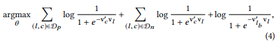
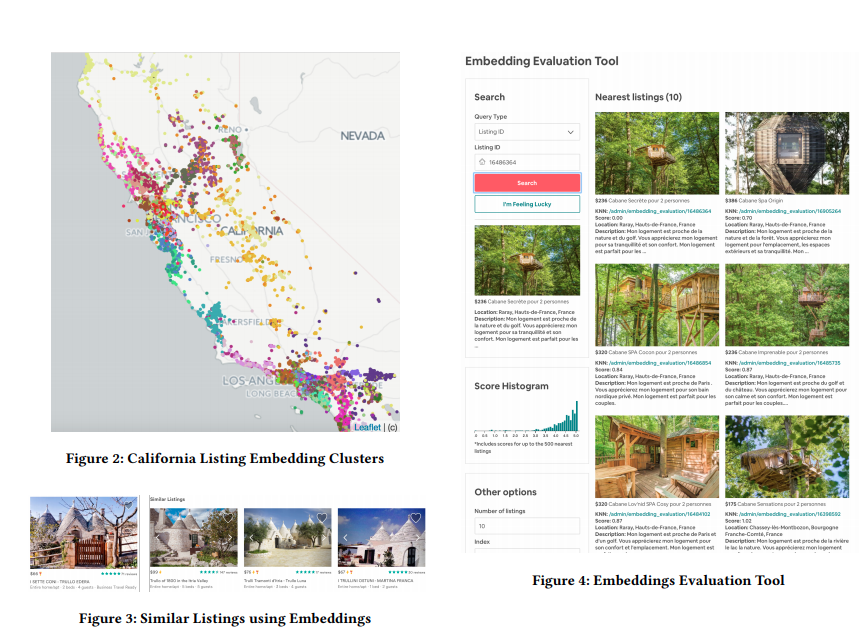
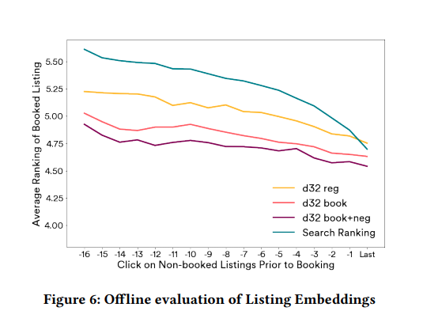

## Embeddings Paper Review: Real-time Personalization using Embeddings for Search Ranking at Airbnb

As part of the paper review exercise, I like to understand the methodology used by the authors, what can we as readers glean from the paper and what are the implementation details that would be really useful if we try to implement it in our own field/organization/team/project. 

### General brief of what authors tried to do in the paper?

Airbnb's team was interested in solving for search ranking and recommendations of the two-way marketplace. Given the complexities of user behavior in terms of travel, the host's interest in approving given guests based on various factors and the need to personalize the recommendations for potential guests, the team turned towards the use of embeddings for listings and users to be used as part of personalization effort in search ranking and similar listing recommendations systems. 

### Why are embedding so important for internet based service providers?

With the advent on internet, majority of lives of modern society is been governed by services providers like Uber (for Travel), Airbnb (for lodging), Spotify (for music), Youtube (for entertainment) and numerous other mobile apps. With the need to continuously provide personalized recommendations, the machine learning field is coming up with innovative methods to either increase website engagement or maximize conversions.  

Embeddings in case of Airbnb offered numerous advantages such as:
- Capture user's short-term and long-term interests
- Calculate similarities between listings that guest interacted with and candidate listings that need to be ranked. 

Since Word2Vec has come out, it (or its variants) has been quickly applied to various fields from Uber, Spotify, YouTube to numerous service providers. Word2Vec offered an opportunity to think of distance between words in terms of similarities and embedding vector of each word as its position in word table space that can describe which words are related and which words are not. 

Authors decided refer to the latest work done in using embeddings in similar marketplaces and perhaps use the latest work as an inspiration for their implementation in Airbnb:

> same can be done for training embeddings of user actions, e.g. items that were clicked or purchased [11, 18], queries and
ads that were clicked [8, 9], by treating sequence of user actions
as context. Ever since, we have seen embeddings being leveraged
for various types of recommendations on the Web, including music recommendations [26], job search [13], app recommendations
[21], movie recommendations [3, 7], etc. Furthermore, it has been
shown that items which user interacted with can be leveraged to
directly lean user embeddings in the same feature space as item
embeddings, such that direct user-item recommendations can be
made [6, 10, 11, 24, 27]. Alternative approach, specifically useful
for cold-start recommendations, is to still to use text embeddings
(e.g. ones publicly available at https://code.google.com/p/word2vec)
and leverage item and/or user meta data (e.g. title and description)
to compute their embeddings [5, 14, 19, 28]. Finally, similar extensions of embedding approaches have been proposed for Social
Network analysis, where random walks on graphs can be used to
learn embeddings of nodes in graph structure [12, 20].
>

### How Airbnb used embeddings for short and long term personalization? 

Given that the authors are focused on two services Search Ranking of Listings and Similar Listings, the authors quest started with creating listing embeddings for short-term personalization and user-type and listing type embeddings for long term personalization. 

#### Listing Embeddings:

Authors focused on taking the click sessions as an uninterrupted sequence of listing ids that were clicked by the users. This is essential for learning the d-dimensional real-valued representations of each unique listing to be able to find similar listings in embedding space. 

In Word2Vec, this is achieved using the skip-gram model of learning listing representations. Given the huge size of sessions that was used as the starting point (800 Million sessions), training a skip-gram model would be infeasible. The authors decided to use the negative-sampling approach to reduce the computational complexity. 

One method that I found particularly interesting from the paper, is the use of booked listings as a global context. Given the marketplace are essentially earning revenue on the basis of whether a recommended listing leads to a conversion or not, it makes sense to capture that booking or conversion as a global context. By treating  booked listing as
global context, it will always be predicted no matter if
it is within the context window or not. 

#### Solving Cold Start Problems:

Authors solved the cold start problem for new listings by utilizing existing embeddings from other listings. 

> Upon listing creation the host is required to provide information
about the listing, such as location, price, listing type, etc. We use
the provided meta-data about the listing to find 3 geographically
closest listings (within a 10 miles radius) that have embeddings,
are of same listing type as the new listing (e.g. Private Room) and
belong to the same price bucket as the new listing (e.g. $20 − $25
per night). Next, we calculate the mean vector using 3 embeddings
of identified listings to form the new listing embedding. Using this
technique we are able to cover more than 98% of new listings.
>

#### Understanding the characteristics represented in embeddings

Once you have trained embeddings model, you would have a natural curiosity to understand what characteristics are been captured by the embeddings. Authors solved this curiosity by using K-means clustering on learned embeddings to find out if geographical similarity was been encoded or not. Authors also wanted to evaluate the cosine similarities between listings from Los Angeles of different listing types. The team developed a tool called embedding evaluation tool to help understand various characteristics of the embedding space. Personally, I find it really interesting that such a tool exists and it would be awesome if Airbnb ever open sourced this tool for the benefit of the other folks. 

#### User-type and listing type Embeddings:

Authors were also interested in capturing the signals coming in from user's long-term history. Authors captured this signal by learn embeddings at type of listing vs at an individual listing level. The reason was to overcome common challenges faced in similar marketplaces such as:
- Usually booking data is smaller than click history
- Given that there is sparsity in bookings from users, we would need longer session lengths
- Historically, it had made sense to use a minimum number of session information to learn any type of embeddings.
- User preferences would change between two bookings such as price point, location etc. 

Authors used a pretty common way to generate buckets of listings. By dividing the integer columns into buckets, any value that fits into the buckets get's assigned a certain bucket id. Similar approach is used for generating user_type buckets. 

For training, the authors used a sequence of booking events (user_type, listing_type) ordered in time as the whole vocabulary. Authors made use of explicit negatives for rejections to capture the feedback from hosts. 

>Given learned embeddings for all user_types and listinд_types,
we can recommend to the user the most relevant listings based
on the cosine similarities between user’s current user_type embedding and listinд_type embeddings of candidate listings.
>

### How team used explicit negatives to account for explicit feedback from hosts?

> Host rejections can be utilized during training to encode the host
preference signal in the embedding space in addition to the guest
preference signal. The whole purpose of incorporating the rejection
signal is that some listing_types are less sensitive to user_types
with no bookings, incomplete profiles and less than average guest star ratings than others, and we want the embeddings of those
listing_types and user_types to be closer in the vector space, such
that recommendations based on embedding similarities would reduce future rejections in addition to maximizing booking chances. 
>

Authors essentially formulated this by combing the booking global context with negative sampling and host rejections.

### How to evaluate the model in offline setting?

The authors propose an evaluation method that uses the embedding vector as a sorting method to compare with real user feedback data:

>More specifically, suppose we obtain the recently clicked listings and the candidate listings that need to be sorted, including the listings that the user finally booked; by calculating the cosine similarity between the clicked listings and the candidate listings in the embedding space, we Can sort the candidate houses and observe the position of the final booked house in the sorting.
>

Authors found better offline performance if they trained embeddings from scratch everyday instead of incrementally continuing training on existing vectors. 

>The day-to-day vector differences do not cause
discrepancies in our models because in our applications we use the
cosine similarity as the primary signal and not the actual vectors
themselves. Even with vector changes over time, the connotations
of cosine similarity measure and its ranges do not change
>

For a listing that got clicked, the recommendations for similar rankings come from calculating cosine similarities between embeddings of clicked and candidate listings. 

As we can observe, search ranking model gets better with more clicks as it uses memorization features. 

### Search Ranking Model

Authors have used a gradient boosting decision tree model which supports lambda rank for ranking the listings for search feature. The list of features vector for an i-th listing consists of listing features, user features, query features and cross-features. NDCG was used a standard ranking metric to evaluate the model on a hold-out set of search sessions. 

Finally, once the model is trained it is used for online scoring of
listings in search. The signals needed to calculate feature vectors xi
for each listing returned by search query q performed by user u are
all calculated in an online manner and scoring happens in parallel
using our sharded architecture. Given all the scores, the listings are
shown to the user in a descending order of predicted utility.

### Listing embedding features storage for real-time inference

Given the need to have quick access to listing embeddings, the team used a search backend (most likely ElasticSearch) to store the 4.5 million embeddings. This allows the team to access them for real-time calculations. 

In addition to the embeddings, the team stores various data sets containing user actions which can be updated via Kafka and Spark/Flink structure. 

[Download paper here](https://dl.acm.org/doi/pdf/10.1145/3219819.3219885)

#### Future articles

Given this is the first public paper review, your comments and review are welcome. I am going to continue reviewing papers and bringing out the technical details in simpler terms and perhaps augment papers with some pseudo codes to showcase my understanding of the architecture used by the authors. I thoroughly enjoyed this paper as it helped me understand how to combine an embeddings system with a GBDT ranking model. 